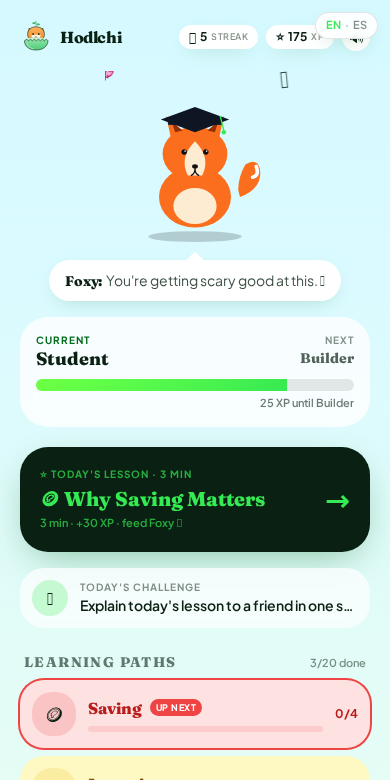
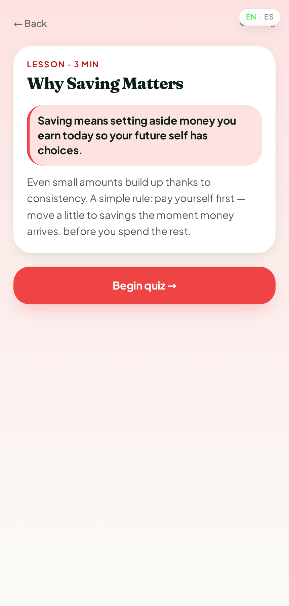
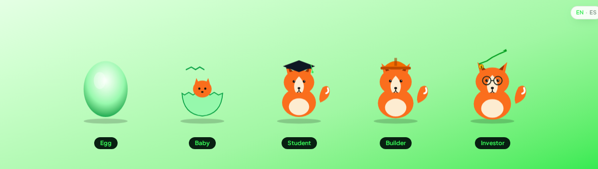
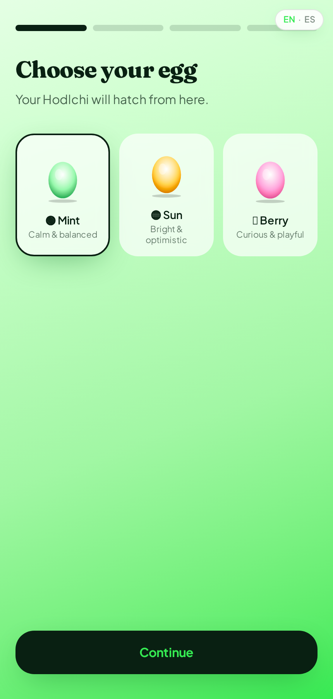
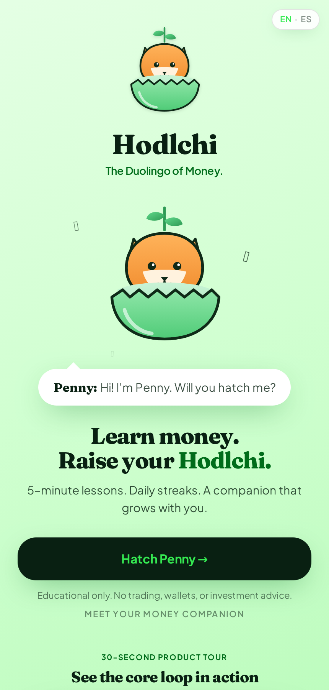
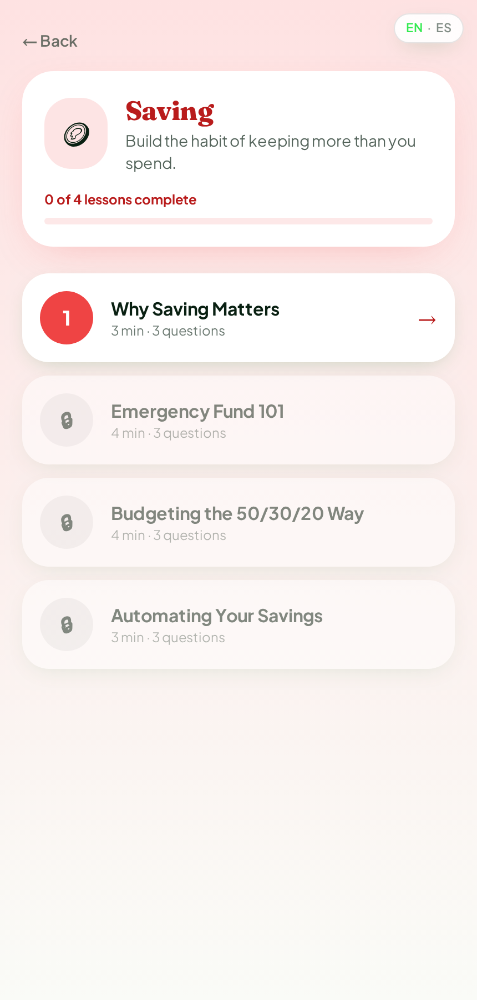
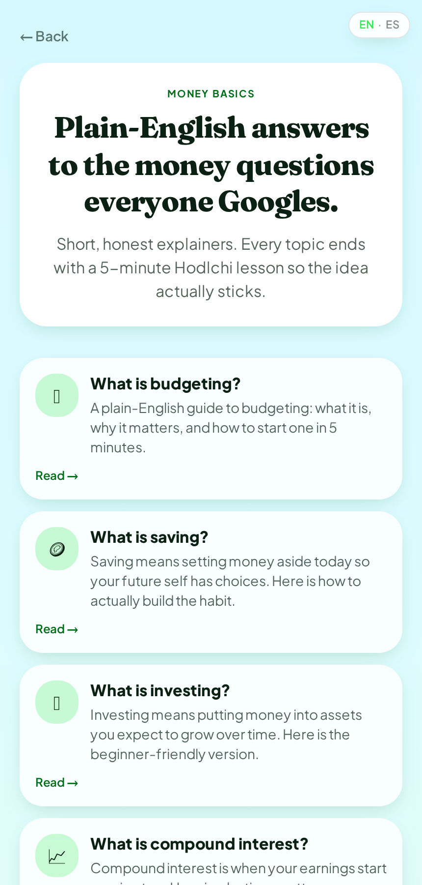

<p align="center">
  
</p>

<h1 align="center">🐣 Hodlchi</h1>

<p align="center"><strong>The Duolingo of Money.</strong></p>

<p align="center">
  Raise <strong>Penny</strong>, your AI financial companion, while building
  real-world money habits in just <strong>five minutes a day</strong>.
</p>

<p align="center">
  
</p>

<p align="center">
  <a href="https://hodlchi.com">🌐 Live app</a> ·
  <a href="https://hodlchi.com/es">🇪🇸 Spanish</a> ·
  <a href="public/media/demo-15s.mp4">🎬 15-second demo</a> ·
  <a href="#-screenshots">📸 Screenshots</a>
</p>

<p align="center">
  
  
  
  
  
</p>

---

## 🐣 Meet Penny

Penny isn't just another chatbot. She's a companion who learns alongside you —
with moods, memory, and idle life. She yawns, stretches, and reacts when you
tap. Feed her a 5-minute lesson and watch her evolve.

<p align="center">
  
</p>

That's Hodlchi in one sentence: a habit product where a cute creature is the
reason you come back, and financial literacy is what you happen to pick up on
the way.

---

## ✨ Features

| | |
| :-- | :-- |
| 🐣 **AI-flavored companion** | Penny has moods, memory, and idle life — she yawns, stretches, and reacts to you. |
| 📚 **5 learning paths** | Saving · Investing · Credit · Entrepreneurship · Crypto — 4 lessons each. |
| 🎯 **3-question quizzes** | Every lesson ends in a short quiz with feedback and XP. |
| 🔥 **Streaks & levels** | Daily-habit loop: XP → level → evolve → return tomorrow. |
| 🥚 **Evolution stages** | Egg → Baby → Student → Builder → Investor → Money Legend. |
| 🌎 **English + Spanish** | Full mirror at `/es` with translated curriculum and SEO. |
| 🔊 **Procedural sound** | Web Audio marimba, coin pings, and Penny's wordless vocalizations. |
| 🎬 **Cinematic evolution** | Shell crack, glow, star burst, screen shake. |
| 📜 **Free certificate** | Print-optimized PDF when the learner finishes. |
| 🤖 **MCP server** | Public read-only tools at `/mcp` for external AI agents. |
| ☁️ **Lovable Cloud backend** | Supabase with RLS-first schemas. |

---

## 📸 Screenshots

### 1. Meet Penny — the emotional hook

<p align="center">
  
</p>

### 2. Learning — quiz UI with progress

<p align="center">
  
</p>

### 3. Evolution — from Egg to Investor

<p align="center">
  
</p>

### 4. Dashboard — streak, level, goals, achievements

<p align="center">
  
</p>

<details>
<summary>More screenshots</summary>

| Landing | Path | Money Basics |
| :-: | :-: | :-: |
|  |  |  |

</details>

---

## 🚀 Quick start

```bash
git clone https://github.com/<your-org>/hodlchi.git
cd hodlchi
bun install                 # or: npm install
cp .env.example .env        # fill in your Supabase / Lovable Cloud keys
bun run dev                 # or: npm run dev
```

Open <http://localhost:8080>.

### Environment variables

Copy `.env.example` to `.env` and fill in:

```bash
VITE_SUPABASE_URL=https://your-project-ref.supabase.co
VITE_SUPABASE_PUBLISHABLE_KEY=your_publishable_anon_key
VITE_SUPABASE_PROJECT_ID=your-project-ref
```

On Lovable, these are provisioned automatically when Cloud is enabled —
`.env.example` is only needed for local development outside Lovable.

---

## 🗺️ Roadmap

- ✅ MVP core loop (hatch → learn → feed → evolve)
- ✅ Penny mood + memory system
- ✅ Cinematic evolution
- ✅ Procedural sound design
- ✅ English + Spanish mirror
- ✅ Public MCP server
- ✅ Completion certificate
- ⬜ Dramatic per-stage avatar redesign
- ⬜ Daily memories ("Yesterday you learned…")
- ⬜ Push notifications / streak reminders
- ⬜ Referral rewards
- ⬜ AI money coach (in-lesson Q&A)
- ⬜ Native mobile app
- ⬜ Multiplayer / group streaks

---

## 🧱 Architecture

- **Framework:** TanStack Start v1 (React 19 + Vite 7, SSR-capable,
  deployed to Cloudflare Workers via Lovable).
- **Styling:** Tailwind CSS v4 with semantic design tokens in `src/styles.css`.
- **Backend:** Lovable Cloud (Supabase) with row-level security.
- **AI:** Lovable AI Gateway (`openai/gpt-5.6-*`, `google/gemini-3.*`).
- **Audio:** Procedural Web Audio API (`src/lib/sfx.ts`).
- **Agent integration:** Public MCP server at `/mcp` (`@lovable.dev/mcp-js`).

### Key routes

| Route | Purpose |
| --- | --- |
| `/` | Landing — Penny greets the visitor |
| `/onboarding` | Hatch Penny (egg → name → personality) |
| `/dashboard` | Daily-habit home |
| `/path/:pathId` | Learning path (4 lessons) |
| `/lesson/:pathId/:lessonId` | Lesson + quiz |
| `/certificate` | Free completion certificate |
| `/money-basics` | Plain-English glossary |
| `/mcp` | Public MCP server for AI agents |
| `/es/*` | Full Spanish mirror |

### How Codex and GPT-5.6 were used

Hodlchi was built end-to-end with **OpenAI Codex-style agentic coding** inside
Lovable, using **GPT-5.6** as the primary reasoning + code-generation model.

- **Curriculum** — 20 lessons across 5 paths (`src/lib/lessons-data.ts`) plus
  the Money Basics glossary (`src/lib/money-basics.ts`).
- **Spanish localization** — full translation of curriculum, UI strings, and
  SEO metadata (`src/lib/lessons-data-es.ts`, `src/lib/money-basics-es.ts`,
  `src/lib/i18n-strings.ts`).
- **Penny's mood + memory** — `deriveMood` state machine and
  personality-specific dialog (`src/lib/hodlchi-store.tsx`,
  `src/lib/penny-greetings.ts`, `src/lib/reflections.ts`).
- **Procedural Web Audio** sound design (`src/lib/sfx.ts`), cinematic
  evolution (`EvolveCinematic.tsx`), and idle-life micro-animations
  (`useIdleLife.ts`).
- **MCP tool schemas** — public curriculum tools at `/mcp`.

**Model routing:** `openai/gpt-5.6-sol` for hard reasoning (curriculum, i18n,
mood state machine); `openai/gpt-5.6-terra` for everyday coding; Lovable AI
Gateway for in-app AI (no user API key required).

---

## 🤝 Contributing

See [CONTRIBUTING.md](./CONTRIBUTING.md).
For security reports, see [SECURITY.md](./SECURITY.md).
Release notes live in [CHANGELOG.md](./CHANGELOG.md).

---

## ⚠️ Disclaimer

Hodlchi is **educational only**. It does not offer trading, wallets, or
investment advice. Nothing in the app should be interpreted as a
recommendation to buy, sell, or hold any asset.

## 📄 License

Hodlchi is source-available but not currently released under an open-source
license. All rights reserved © Hodlchi.
